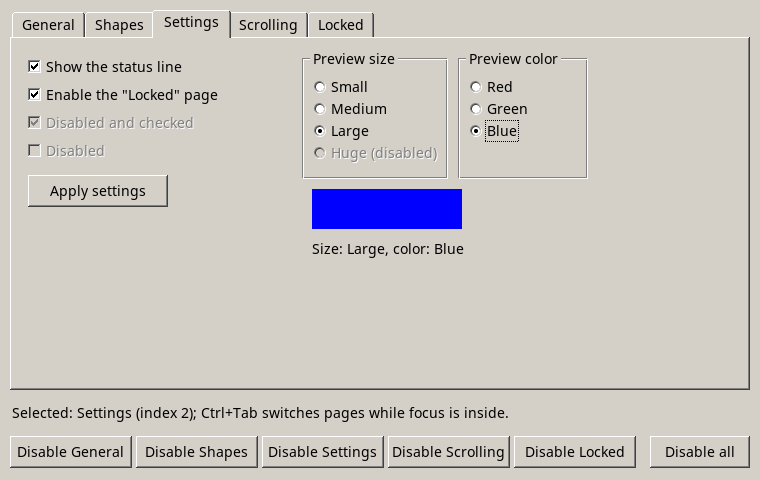
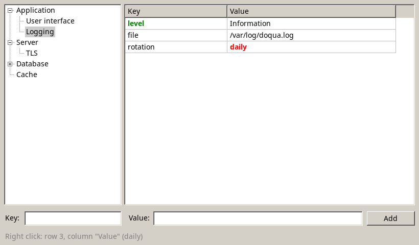
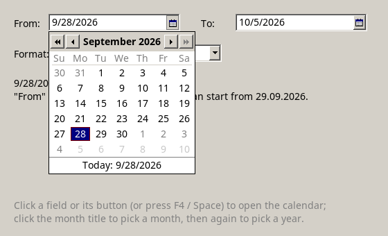
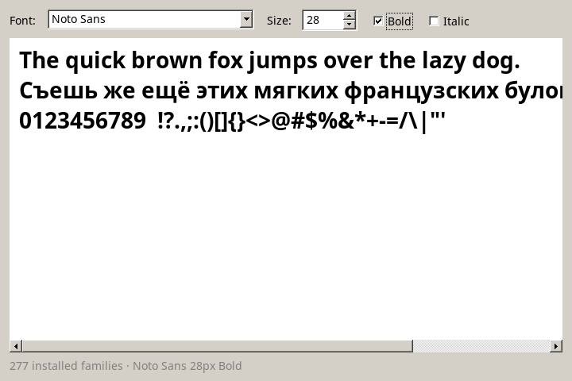
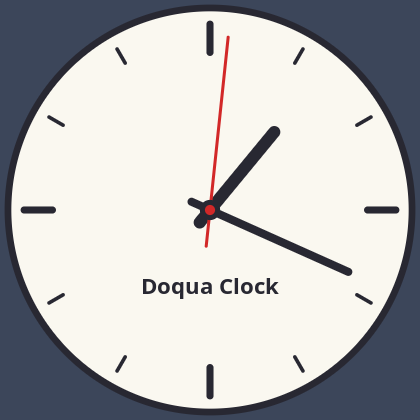

<p align="center">
  
</p>

<h1 align="center">Doqua</h1>

<p align="center">A small cross-platform GUI library for .NET, in the classic desktop style.</p>

<p align="center">
  
  
</p>

Doqua draws its controls itself into a software framebuffer. The same code runs on Linux (X11) and Windows,
with no native dependencies beyond what the system already has: libX11, fontconfig and FreeType on Linux,
and GDI on Windows.

## Features

- Windows, a control tree and anchored layout
- Classic 3D look: buttons, tabs, check boxes, radio buttons, scroll bars
- Single-line and multi-line text editors with selection, clipboard and context menus
- Combo boxes, number inputs, and date inputs with a calendar
- Tables with resizable columns, tree views and split panels
- Scrolling panels, keyboard focus and Tab navigation, mouse cursors
- Native font rendering, PNG loading and saving, and custom drawing (lines, ellipses, bitmaps, alpha blending)
- Timers, window icons, and localization (English by default)

## Quick start

Requires the [.NET 10 SDK](https://dotnet.microsoft.com/download).

```sh
dotnet new console -n MyApp
cd MyApp
dotnet add reference ../Doqua/Sources/Doqua.csproj
```

```csharp
using Doqua.Controls;
using Doqua.GUI;

var status = new Label { X = 20, Y = 60, Text = "Not clicked yet" };
var button = new Button { X = 20, Y = 20, Text = "Click me" };
button.Click += (sender, e) => status.Text = "Clicked!";

return Application.Run(new Window
{
    Title = "Hello, Doqua",
    Width = 320,
    Height = 120,
    Content = new Panel { Children = { button, status } },
});
```

```sh
dotnet run
```

## Examples

Build them all with `dotnet build Examples/examples.sln`, and run one with `dotnet run --project Examples/Tabs`.

| Example | Shows |
|---|---|
| [Simple](Examples/Simple) | Anchored panels, clickable rectangles, buttons, an input and a live clock |
| [Tabs](Examples/Tabs) | TabControl, check boxes, radio groups, scrolling panels and context menus |
| [Dictionary](Examples/Dictionary) | TreeView and Table in a SplitContainer, with per-cell colors |
| [Editor](Examples/Editor) | Multi-line TextArea with scroll bars |
| [DateTime](Examples/DateTime) | DateInput with a calendar, and date formats |
| [Fonts](Examples/Fonts) | Installed font families, NumberInput and a live preview |
| [Localization](Examples/Localization) | Switching the user interface between English and Russian |
| [Bitmap](Examples/Bitmap) | Loading, drawing, scaling and saving PNG images |
| [Clock](Examples/Clock) | A custom control that draws an analog clock |

<p>
  
  
  
</p>

## Documentation

The full documentation is in [`Docs/html`](Docs/html): guides, example pages and the complete API reference,
with search. It is a static site, so open `Docs/html/index.html` in a browser; no server is needed.

To regenerate it after changing the library:

```sh
dotnet run --project Tools/DocGen
```

The generator reads `doqua.dll`, its XML documentation comments, and the guide pages in `Tools/DocGen/Pages`.

## Repository layout

| Folder | Contents |
|---|---|
| `Sources` | The library (`Doqua.csproj` builds `doqua.dll`). `Doqua.GUI` holds windows, drawing and input; `Doqua.Controls` holds the controls |
| `Examples` | Example applications (`examples.sln`) |
| `Docs` | Logo, icons and the HTML documentation |
| `Tools/DocGen` | The documentation generator |

## Platform notes

- **Linux:** needs an X11 display. On Wayland desktops it runs through XWayland. Keyboard layouts and input methods work through XIM.
- **Windows:** needs Windows 10 or later. The Windows backend has been tested less than the Linux one.
- **Not yet supported:** high-DPI scaling, font fallback, and popups that extend outside their window.

## License

Doqua is **free for examples, demos and teaching materials**. For example, you can use it for the sample
applications of your library, a demo program shipped with your SDK, a program that presents your product
(including commercial ones), or a book, course or tutorial. You may copy and distribute Doqua, in source or
binary form and modified or not, as part of those examples, demos and teaching materials.

Using Doqua in the product itself, in production applications for end users, or redistributing it as part of other
software requires a separate written license.
See [LICENSE](LICENSE) for the exact terms, and contact dima@overch.uk for other licensing.

Copyright © 2026 Dmitry Overchuk.
